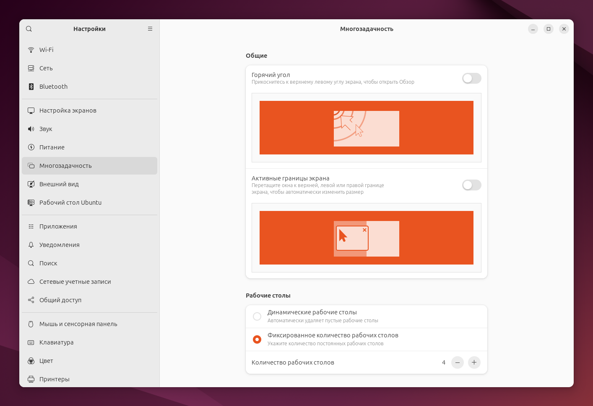
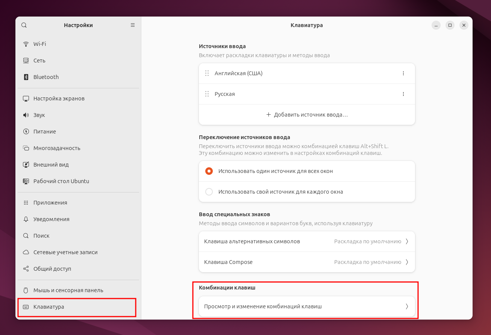
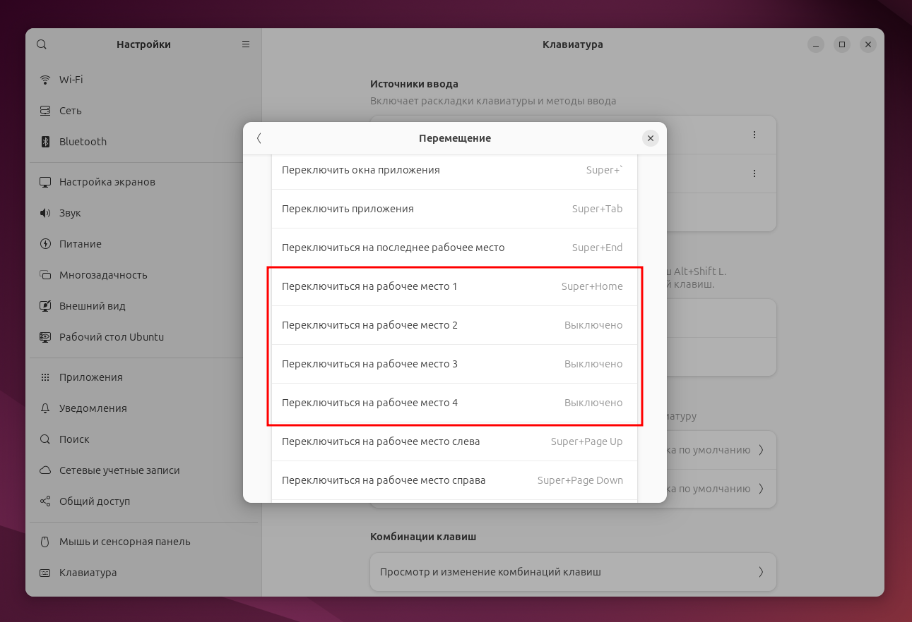

# Настройка переключения раскладки клавиатуры с помощью Alt-Shift на Ubuntu 24.04 в Wayland
Как известно, встроенное окно для ввода комбинации клавиш переключения раскладки не дает вводить такие привычные комбинации как **Alt-Shift** и **Ctrl-Shift**.

Для настройки этих комбинаций переключения раскладки, можно воспользоваться командами:

```bash
gsettings set org.gnome.desktop.wm.keybindings switch-input-source "['<Alt>Shift_L']"
gsettings set org.gnome.desktop.wm.keybindings switch-input-source-backward "['<Shift>Alt_L']"
```
# Добавляем индикацию раскладки на самой клавиатуре индикатором Scroll Lock
```bash
gsettings set org.gnome.desktop.input-sources xkb-options "['grp_led:scroll', 'grp:alt_shift_toggle']"
```

Кстати, это убирает индикацию переключения раскладки на экране.
Если ходите вернуть как было – сбросьте этот параметр:
```bash
gsettings reset org.gnome.desktop.input-sources xkb-options
gsettings get org.gnome.desktop.input-sources xkb-options
```
# Настройка количества рабочих столов
Открываем **Настройки/Многозадачность** переключаем на **Фиксированное количество рабочих столов**:



Указываем **Количество рабочих столов**.

# Настройка быстрых клавиш для переключения между рабочими столами
Открываем **Настройки/Клавиатура/Комбинации клавиш**, выбираем Просмотр и изменение комбинаций клавиш:



Далее, идем в **Перемещение/Переключиться на рабочее место 1** и назначаем нужное сочетание клавиш:



В данном диалоге можно назначить сочетания только для четырех рабочих столов, если нужно больше, то это можно сделать через консоль:
```bash
gsettings set org.gnome.desktop.wm.keybindings switch-to-workspace-10 "['<Alt>0']"
```

# Как убрать задержку после ввода неправильного пароля в Ubuntu?
В файле **/etc/pam.d/common-auth** нужно добавить опцию **nodelay**:
```bash
auth    [success=1 default=ignore]      pam_unix.so nullok nodelay
```

Это уберет задержку между неправильными паролями как в прямом входе пользователя, через **sudo**, так и через **SSH** подключение.

# Управление питанием при закрытии крышки ноутбука
В файле **/etc/systemd/logind.conf** ищем строку **HandleLidSwitch=suspend**.

По умолчанию используется режим **suspend**. Так же можно использовать:
- **hibernate**
- **ignore**
- **poweroff**.

Другие режимы можно посмотреть в Документации.

Размер SWAP-файла/раздела рекомендуется держать не меньшим, чем размер ОЗУ, хотя и с меньшим размером гибернация во многих случаях будет работать.
